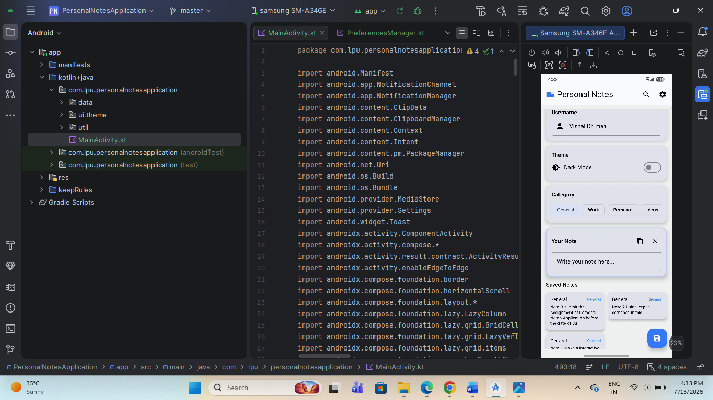
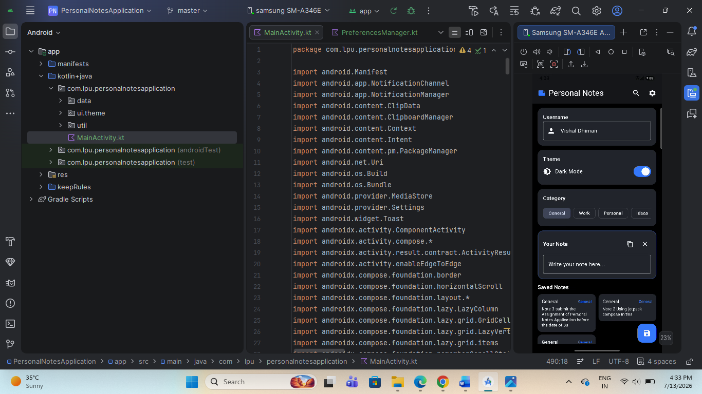
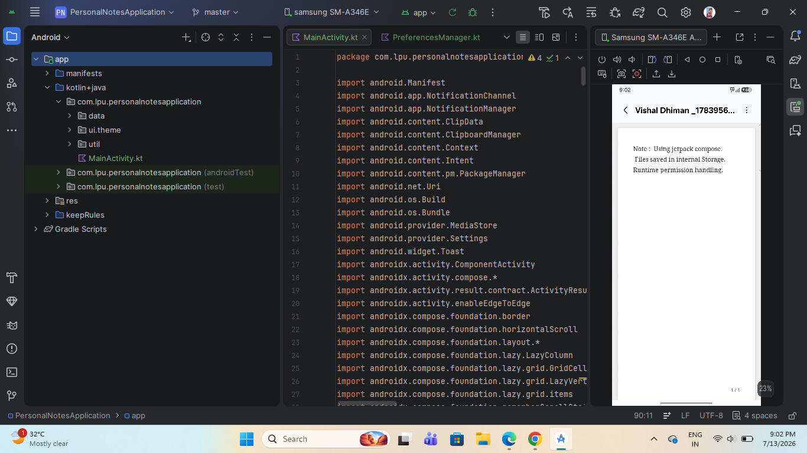

# 📝 Personal Notes Application

A modern Android Personal Notes Application built using Kotlin and Jetpack Compose. The app allows users to create and save notes, customize their experience with **DataStore preferences**, and securely store note files using **Scoped Storage**. It features a clean Material 3 interface with note statistics, category selection, clipboard support, and dark mode.

---

## ✨ Features

- 📝 Create and edit personal notes
- 💾 Save notes as `.txt` files
- 👤 Save username using DataStore
- 🌙 Dark & Light Theme support
- 📂 Scoped Storage implementation
- 📋 Copy notes to clipboard
- 🗑️ Clear notes with confirmation dialog
- 📊 Word and character count
- 🏷️ Note categories (General, Work, Personal, Ideas, Todo)
- 🔔 Snackbar notifications
- 📱 Responsive Material 3 UI
- ⚡ Built completely with Jetpack Compose

---

## 🛠️ Technologies Used

- Kotlin
- Jetpack Compose
- Material 3
- Jetpack DataStore
- Scoped Storage
- Activity Result API
- Runtime Permissions
- ClipboardManager
- Snackbar
- Android Studio

---

## 📂 Project Structure

```
app/
│
├── MainActivity.kt
├── data/
│   └── PreferencesManager.kt
├── ui/
│   ├── theme/
│   └── Components
└── AndroidManifest.xml
```

---

# 📱 Screenshot

<p align="center">
  
   
    
  
</p>

---

## 🚀 Application Modules

### 👤 User Preferences

- Save Username
- Remember Theme Selection
- Persistent DataStore Storage

---

### 📝 Notes

Users can:

- Create Notes
- Edit Notes
- Copy Notes
- Clear Notes
- Save Notes as Text Files

---

### 📂 Categories

Available categories:

- General
- Work
- Personal
- Ideas
- Todo

---

### 📊 Note Statistics

Displays:

- Word Count
- Character Count
- Selected Category
- Last Edited Time

---

### 🌙 Theme Settings

- Dark Mode
- Light Mode
- Stored using Jetpack DataStore

---

## 🎨 UI Components

The application includes:

- Top App Bar
- Material Cards
- Outlined TextFields
- Filter Chips
- Floating Action Button
- Snackbar
- AlertDialog
- Switch
- Material Icons

---

## 📁 Data Storage

### Jetpack DataStore

Stores:

- Username
- Theme Preference

### Scoped Storage

Uses the Android Storage Access Framework to securely save notes as **.txt** files without requiring broad storage access on modern Android versions.

---

## 🔐 Permissions

### Android 9 and below

Storage permission:

```xml
<uses-permission android:name="android.permission.WRITE_EXTERNAL_STORAGE"/>
```

For Android 10 and above, the app uses the Storage Access Framework (CreateDocument API), so broad storage permission is not required.

---

## 🚀 Future Improvements

- Multiple Notes
- Search Notes
- Edit Saved Notes
- Delete Saved Notes
- PIN Lock
- Biometric Authentication
- Cloud Backup
- Room Database
- Rich Text Formatting
- Reminder Notifications

---

## ⚙️ Installation

Clone the repository:

```bash
git clone https://github.com/yourusername/PersonalNotesApplication.git
```

Open the project in **Android Studio**.

Build and run the application on an Android device or emulator.

---

## 📷 Screenshot

Place your screenshot inside the project folder:

```
PersonalNotesApplication/
│
├── README.md
├── personal_notes_ui.png
```

---

## 🎯 Learning Outcomes

This project demonstrates practical knowledge of:

- Kotlin Programming
- Jetpack Compose
- Material 3
- Jetpack DataStore
- Scoped Storage
- Runtime Permissions
- Activity Result API
- State Management
- Snackbar
- ClipboardManager
- Responsive Android UI Design

---

## 👨‍💻 Author

**Vishal Dhiman**

**B.Tech Student | Android Developer**

Passionate about Android Development, Kotlin, Jetpack Compose, and building modern Android applications.

---
